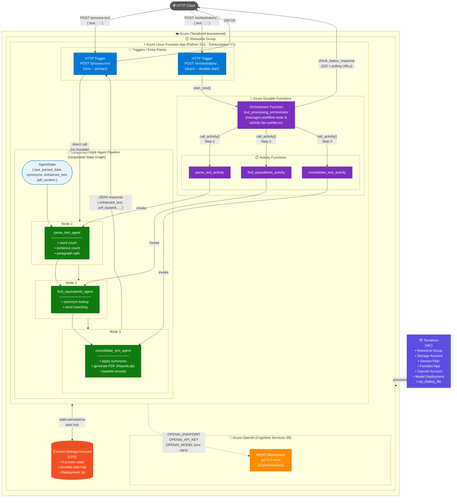

# Architecture Diagram

## Overview

This solution is an **Azure Durable Functions** application (Python 3.11) deployed via **Terraform** that orchestrates a multi-agent text processing pipeline. The agents follow a **LangGraph-style** sequential state graph pattern, passing a shared `AgentState` object through each node.

---

## Architecture Diagram



---

## Component Descriptions

| Component | Type | Role |
|---|---|---|
| **HTTP Trigger** `/process-text` | Azure Function | Synchronous entry point — calls agents directly and returns a full JSON response immediately |
| **HTTP Trigger** `/orchestrators/...` | Azure Function | Async entry point — starts a Durable orchestration and returns polling URLs (202) |
| **`text_processing_orchestrator`** | Durable Orchestrator | Manages the sequential workflow; calls each activity in order, maintains state across retries/replays |
| **`parse_text_activity`** | Durable Activity | Wraps `parse_text_agent`; executed as a reliable, retryable unit of work |
| **`find_equivalents_activity`** | Durable Activity | Wraps `find_equivalents_agent`; executed as a reliable, retryable unit of work |
| **`consolidate_text_activity`** | Durable Activity | Wraps `consolidate_text_agent`; executed as a reliable, retryable unit of work |
| **`parse_text_agent`** | LangGraph Node | Analyzes text: word count, sentence count, paragraph split → updates `AgentState.parsed_data` |
| **`find_equivalents_agent`** | LangGraph Node | Finds synonyms for words in the text → updates `AgentState.synonyms` |
| **`consolidate_text_agent`** | LangGraph Node | Applies synonyms, generates a PDF via ReportLab, base64-encodes it → updates `AgentState.enhanced_text` & `pdf_content` |
| **Azure Storage Account** | Infrastructure | Hosts the Durable Task Hub (orchestration state), function deployment zip, and runtime state |
| **Azure OpenAI / gpt-5.4-nano** | AI Service | Available to agents via environment variables (`OPENAI_ENDPOINT`, `OPENAI_API_KEY`, `OPENAI_MODEL`) |
| **Terraform** | IaC | Provisions all Azure resources: Resource Group, Storage, Service Plan, Function App, OpenAI account & model deployment |

---

## Two Execution Paths

### Path A — Synchronous (HTTP Trigger)
```
Client → POST /process-text
       → parse_text_agent
       → find_equivalents_agent
       → consolidate_text_agent
       → 200 OK { enhanced_text, pdf_base64, ... }
```

### Path B — Asynchronous (Durable Functions + LangGraph)
```
Client → POST /orchestrators/...
       → DurableOrchestrationClient.start_new()
       → Orchestrator: call_activity("parse_text_activity")
                     → parse_text_agent (LangGraph Node 1)
       → Orchestrator: call_activity("find_equivalents_activity")
                     → find_equivalents_agent (LangGraph Node 2)
       → Orchestrator: call_activity("consolidate_text_activity")
                     → consolidate_text_agent (LangGraph Node 3)
       → 202 Accepted + status/result polling URLs
```
