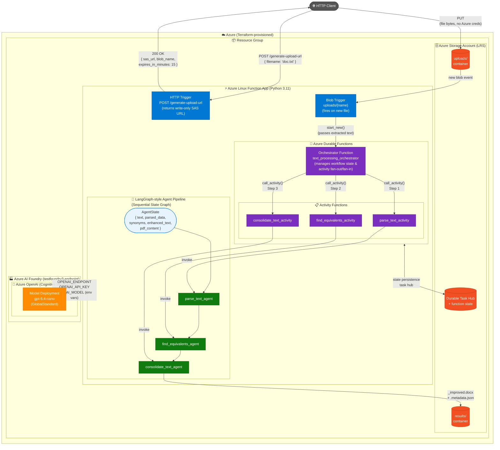

# Architecture Diagram

## Overview

This solution is an Azure Durable Functions application (Python 3.11) deployed via Terraform that orchestrates a multi-agent text processing pipeline. The agents follow a LangGraph-style sequential state graph pattern, passing a shared AgentState object through each node.

***

## Architecture Diagram — Version 2: SAS Upload + Blob Trigger Pipeline



***

## Component Descriptions

| Component                         | Type                  | Role                                                                                                                               |
| --------------------------------- | --------------------- | ---------------------------------------------------------------------------------------------------------------------------------- |
| HTTP Trigger /process-text        | Azure Function        | Synchronous entry point — calls agents directly and returns a full JSON response immediately                                       |
| HTTP Trigger /orchestrators/...   | Azure Function        | Async entry point — starts a Durable orchestration and returns polling URLs (202)                                                  |
| HTTP Trigger /generate-upload-url | Azure Function        | Generates a write-only SAS URL (15 min TTL) so the client can upload .txt/.docx files directly to Blob Storage via PUT             |
| Blob Trigger uploads/\{name}      | Azure Function        | Fires automatically when a file lands in the uploads container; extracts text and starts a Durable orchestration                   |
| text\_processing\_orchestrator    | Durable Orchestrator  | Manages the sequential workflow; calls each activity in order, maintains state across retries/replays                              |
| parse\_text\_activity             | Durable Activity      | Wraps parse\_text\_agent; executed as a reliable, retryable unit of work                                                           |
| find\_equivalents\_activity       | Durable Activity      | Wraps find\_equivalents\_agent; executed as a reliable, retryable unit of work                                                     |
| consolidate\_text\_activity       | Durable Activity      | Wraps consolidate\_text\_agent; executed as a reliable, retryable unit of work                                                     |
| parse\_text\_agent                | LangGraph Node        | Analyzes text: word count, sentence count, paragraph split → updates AgentState.parsed\_data                                       |
| find\_equivalents\_agent          | LangGraph Node        | Finds synonyms for words in the text → updates AgentState.synonyms                                                                 |
| consolidate\_text\_agent          | LangGraph Node        | Applies synonyms, generates a PDF via ReportLab, base64-encodes it, saves \_improved.docx + .metadata.json to results/             |
| Azure Storage Account             | Infrastructure        | Hosts the Durable Task Hub (orchestration state), uploads/ and results/ containers, function deployment zip                        |
| uploads/ container                | Azure Blob Storage    | Receives client-uploaded files via SAS PUT URL                                                                                     |
| results/ container                | Azure Blob Storage    | Stores pipeline output: \_improved.docx and .metadata.json per processed file                                                      |
| Azure AI Foundry                  | AI Platform           | Project hub (testfoundry3-endpoint) that hosts the Azure OpenAI account and model deployment                                       |
| Azure OpenAI                      | Cognitive Services S0 | Provides the OpenAI-compatible API endpoint; credentials injected into Function App via env vars                                   |
| gpt-5.4-nano                      | Model Deployment      | GlobalStandard deployment hosted under Azure AI Foundry; available to agents via OPENAI\_ENDPOINT, OPENAI\_API\_KEY, OPENAI\_MODEL |
| Terraform                         | IaC                   | Provisions all Azure resources: Resource Group, Storage, Service Plan, Function App, OpenAI account & model deployment             |

***

## Three Execution Paths

### Path A — Synchronous (HTTP Trigger)

```
Client → POST /process-text { text: '...' }
       → parse_text_agent        (LangGraph Node 1)
       → find_equivalents_agent  (LangGraph Node 2)
       → consolidate_text_agent  (LangGraph Node 3)
       → 200 OK { enhanced_text, pdf_base64, ... }
```

### Path B — Asynchronous (Durable Functions + LangGraph)

```
Client → POST /orchestrators/...
       → DurableOrchestrationClient.start_new()
       → Orchestrator: call_activity("parse_text_activity")
                     → parse_text_agent        (LangGraph Node 1)
       → Orchestrator: call_activity("find_equivalents_activity")
                     → find_equivalents_agent  (LangGraph Node 2)
       → Orchestrator: call_activity("consolidate_text_activity")
                     → consolidate_text_agent  (LangGraph Node 3)
       → 202 Accepted + status/result polling URLs
```

### Path C — SAS Upload + Blob Trigger + Durable Functions

```
Client → POST /generate-upload-url { filename: 'doc.txt' }
       ← 200 OK { sas_url, blob_name, expires_in_minutes: 15 }

Client → PUT <sas_url>  (file bytes, no Azure credentials needed)
       → uploads/ container  (blob created)

Blob Trigger fires automatically:
       → _extract_text()  (.txt decoded / .docx parsed)
       → DurableOrchestrationClient.start_new()  (passes extracted text)
       → Orchestrator: call_activity("parse_text_activity")
                     → parse_text_agent        (LangGraph Node 1)
       → Orchestrator: call_activity("find_equivalents_activity")
                     → find_equivalents_agent  (LangGraph Node 2)
       → Orchestrator: call_activity("consolidate_text_activity")
                     → consolidate_text_agent  (LangGraph Node 3)
                     → results/<base />_improved.docx
                     → results/<base />.metadata.json
```

​
